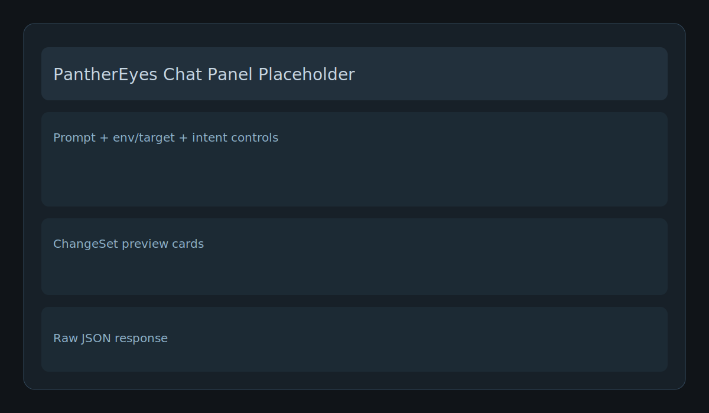
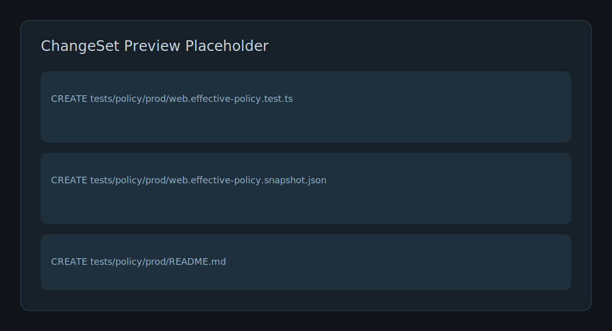

# PantherEyes VS Code Extension

VS Code extension to integrate with the PantherEyes `agent-server`, send prompts to the `/chat` endpoint, and preview `ChangeSet` results interactively.

## Features

- Command `PantherEyes: Ask Agent`
- Command `PantherEyes: Validate Security Config`
- Command `PantherEyes: Run Scan` (opens a terminal running the CLI)
- Command `PantherEyes: Set LLM Provider` (BYOK-ready via `SecretStorage`, no real provider yet)
- Simple chat panel (Webview) with response + `ChangeSet` preview

## Configuration

Supported settings:

- `panthereyes.agentServerUrl` (default: `http://localhost:4711/chat`)
- `panthereyes.defaultEnv` (default: `dev`)
- `panthereyes.defaultTarget` (default: `web`)

## Run with F5

1. From the monorepo root, build the dependencies used by `agent-server` and start the server on `4711`:

```bash
PORT=4711 node apps/agent-server/dist/index.js
```

2. In VS Code, open the `PantherEyes` folder.
3. Open `apps/vscode-extension` in the workspace (or keep the monorepo root open).
4. Press `F5` to open a new Extension Development Host window.
5. In the development window, open the Command Palette and run:
   - `PantherEyes: Ask Agent`

## Expected Flow

- Enter a prompt in the chat panel.
- The extension sends a `POST` request to `http://localhost:4711/chat`.
- The JSON response is displayed in the panel.
- The `ChangeSet` is shown as cards with content previews.

## Example Payload Sent to `agent-server`

```json
{
  "message": "Generate policy tests for prod web",
  "intent": "generate_policy_tests",
  "context": {
    "env": "prod",
    "target": "web",
    "rootDir": "/path/to/workspace"
  }
}
```

## Screenshots (placeholders)

### Chat panel



### ChangeSet preview



## Common Errors

- `Could not reach PantherEyes agent...`
  - Verify that `agent-server` is running at `http://localhost:4711/chat`.
- `Request body is empty` or `400`
  - Check the payload and the `env/target` fields in the panel.
- `cargo run ...` fails when running `Run Scan`
  - Confirm the Rust toolchain is installed and the monorepo is opened at the root.
